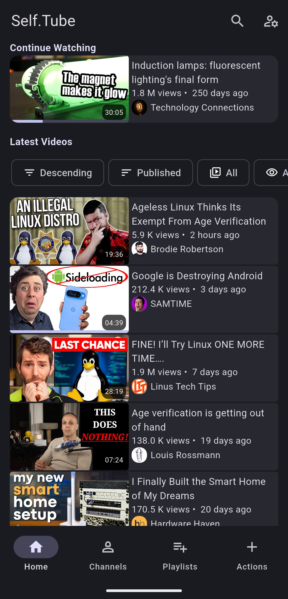
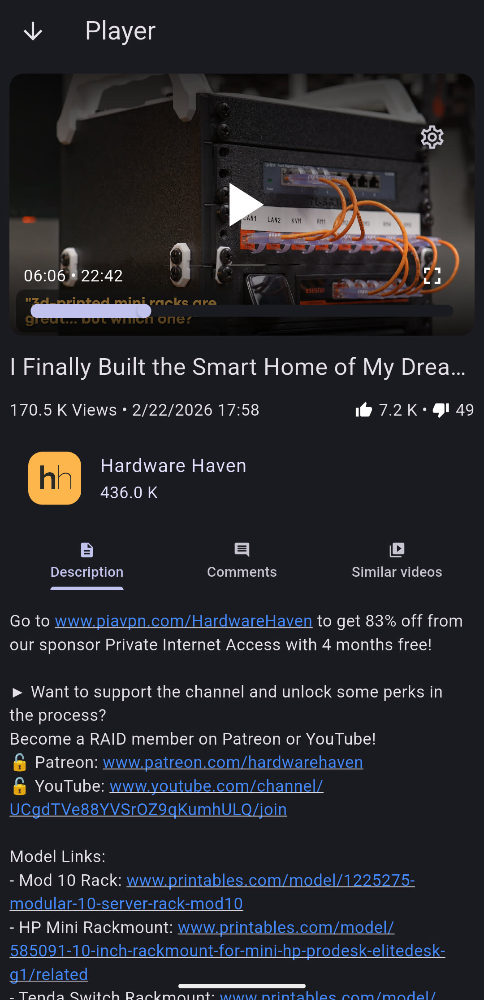
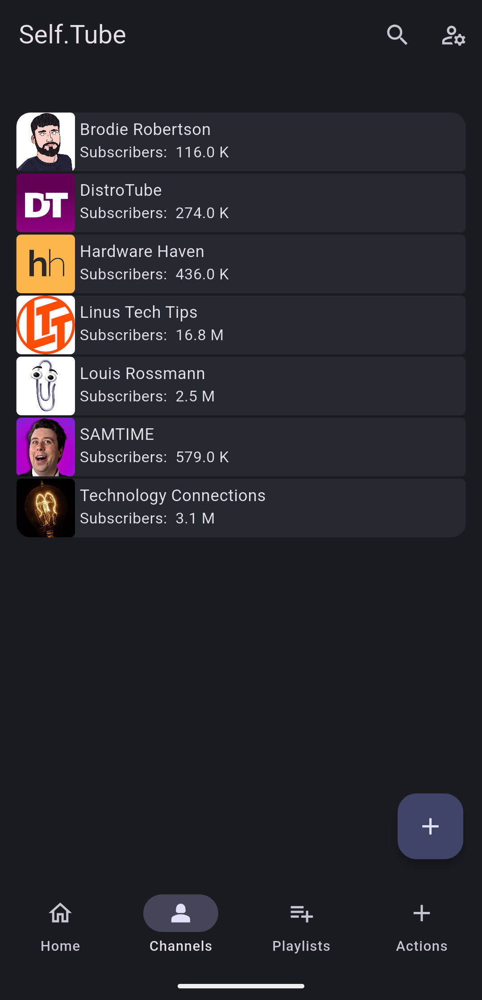
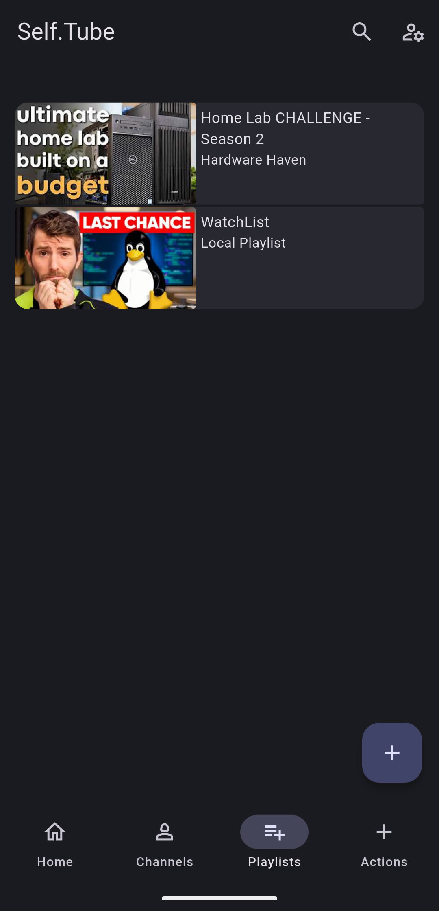
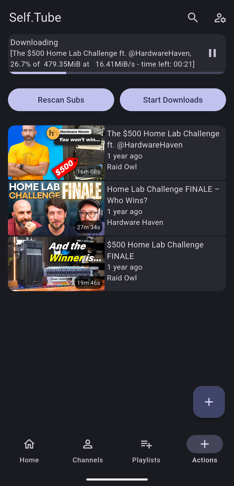

  

# Self.Tube

**Self.Tube** will be a sleek, lightweight client for [TubeArchivist](https://github.com/tubearchivist/tubearchivist), designed to bring your personal YouTube archive right to your Android or Linux phone.

With a streamlined interface and direct connection to your TubeArchivist server, Self.Tube will make it easy to browse, search, and stream your archived content from anywhere.

## Screenshots

## Download

  
  

## Features

- [x]  Browse TubeArchivist library
- [x]  Search archived videos
- [x]  Stream directly from your server
- [x]  Android phone support
- [x]  Sponsorblock support
- [X]  Linux phone support (tested with PostmarketOS)
- [X]  Basic Library management
- [X]  Basic Playlist management
- [ ]  Subtitle support ([#6](https://codeberg.org/WreckingBANG/Self.Tube/issues/6))
- [ ]  Offline playback ([#23](https://codeberg.org/WreckingBANG/Self.Tube/issues/23))
- [ ]  Jellyfin Integration for Transcoding ([#18](https://codeberg.org/WreckingBANG/Self.Tube/issues/18))

## Why Self.Tube

TubeArchivist is amazing for archiving, but it’s built for use in a Web-Browser. Self.Tube fills the gap by giving you a native app experience tailored for mobile devices. It’s open-source, privacy-respecting, and built for power users who want full control of their media.

## Contributing

Every help is welcome. Feel free to open issues, suggest improvements, or submit pull requests.

## Translations

## Contributors

Thanks to everyone who has helped improve Self.Tube!

- [@WreckingBANG](https://codeberg.org/WreckingBANG) - Creator & maintainer
- [@BlackZ](https://codeberg.org/BlackZ) - Polish Translations
- [@Vistaus](https://codeberg.org/Vistaus) - Dutch Translations

## License

Self.Tube is [Free Software](https://en.wikipedia.org/wiki/Free_software). You have the freedom to use, study, share, and modify it as you wish.

This app is licensed under the terms of the [GNU Affero General Public License version 3 or later](https://www.gnu.org/licenses/agpl-3.0.html), as published by the [Free Software Foundation](https://www.fsf.org/). This ensures that any modifications or networked use of the software must also remain free and open.
